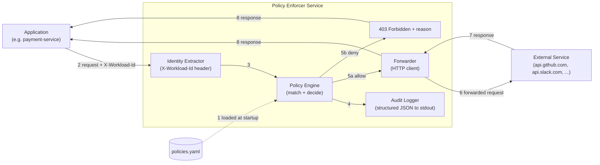

# k8s-egress-policy-enforcer

A small Go service that enforces configurable egress policies for Kubernetes workloads: a
workload sends its outbound HTTP request through the enforcer, which identifies the caller, evaluates policies, and either forwards the request to the destination or denies it.

## Architecture



### Components

- **Identity Extractor** - reads the calling workload's identity from the request ( please see
  Assumptions  for how this would be hardened in production).
- **Policy Engine** - matches the workload, destination host, and HTTP method against the
  loaded policies and returns an allow/deny decision with a reason.
- **Audit Logger** - emits one structured JSON record per request (timestamp, request ID,
  workload, destination, method, decision, reason), regardless of outcome.
- **Forwarder** - relays allowed requests to the real destination and streams back the
  response; denied requests never leave the enforcer.

## Running Locally

```sh
go run ./cmd/enforcer                        # listens on :8080, loads policies/example.yaml
go run ./cmd/enforcer -policy-file ./my-policies.yaml
go test ./...                                 # unit tests (policy engine, loader, proxy handler)
```

Or via `make` (see [Makefile](Makefile)): `make build`, `make test`, `make run`.

Or in Docker: `make docker-build && make docker-run` (listens on `:8080`, uses the `policies/example.yaml`; we can mount own policies in yaml/json via  `-policy-file` for anything else).

## Documentation

This README covers the basics; the rest of the detail lives in [docs/](docs):

- [Policy Configuration & Evaluation](docs/POLICY.md) - YAML policy format, the specificity
  scoring algorithm, and how ties/no-matches are resolved.
- [Example Requests](docs/EXAMPLES.md) - `curl` walkthroughs of allow/deny/error paths and the
  resulting audit log lines.
- [Design Decisions, Assumptions & Failure Behavior](docs/DESIGN.md) - why the service is built
  the way it is, what it assumes about its environment, and the full failure-mode table.
- [Production Considerations](docs/PRODUCTION.md) - Kubernetes/Envoy/Istio integration for
  unspoofable identity, hot-reloadable policy, and what else would change for production use.
