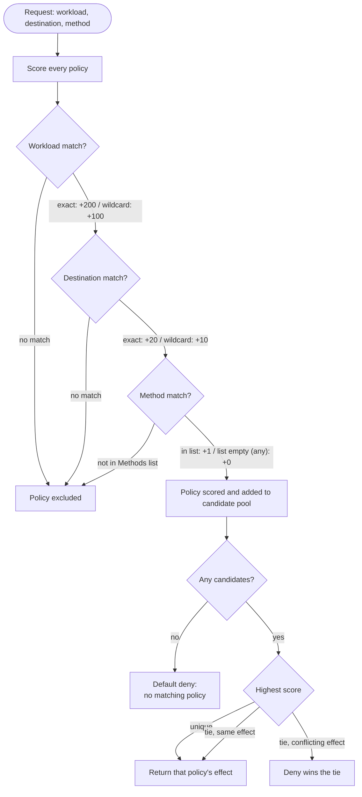

# Policy Configuration & Evaluation

## Policy Configuration

Policies are declared in YAML (JSON also parses, since JSON is valid YAML) and loaded once at
startup. Each policy says: this `workload`, calling this `destination`, with one of these
`methods` (omit for "any method"), should be `allow`ed or `deny`ed.

```yaml
policies:
  - workload: payment-service
    destination: api.github.com
    methods: [GET]
    effect: allow

  - workload: payment-service
    destination: api.slack.com
    methods: [POST]
    effect: allow

  - workload: payment-service
    destination: "*"
    effect: deny
```

`workload` and `destination` both support the literal wildcard `"*"`, matching any value. A
policy with no `methods` listed matches any HTTP method.

## Policy Evaluation Engine

For every request, the engine (`internal/policy/engine.go`) scans **all** policies and scores
each one that *could* apply, rather than stopping at the first match. This makes the outcome
independent of the order policies are written in the file.

### Scoring

Each of the three fields contributes points based on how specifically it matched:

| Field       | Exact match | Wildcard (`*`) match | No match          |
|-------------|:-----------:|:--------------------:|:-----------------:|
| workload    | 2           | 1                     | policy excluded   |
| destination | 2           | 1                     | policy excluded   |
| method      | 1 (in list) | 0 (list omitted = any)| policy excluded   |

The total specificity score is:

```
score = workload_score * 100 + destination_score * 10 + method_score
```

Weighting workload highest, then destination, then method means an exact-workload match always
outranks a wildcard-workload match, regardless of how the other fields compare - and similarly
for destination over method. Among the policies that apply, the **highest-scoring one wins**.

### Resolving ties and no-matches

- **Tie, same effect** - doesn't matter which one "wins", the decision is identical.
- **Tie, conflicting effect** (e.g. two equally specific policies, one `allow` and one `deny`)
  - **deny wins**, so ambiguous configuration fails safe instead of silently allowing traffic.
- **No policy applies at all** - **default deny**, with reason `"no matching policy; default
  deny"`. An unconfigured workload or destination is denied, not allowed.


