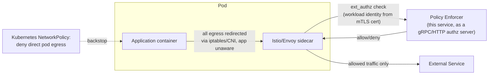

# Production Considerations

## Kubernetes/Envoy/Istio Integration

The goal in production is that an application **cannot bypass** the enforcer - today's
explicit-call design relies on the app cooperating. Closing that gap is a deployment/identity
change, not a change to the enforcer's decision logic:

- **Traffic can't skip the sidecar**: Istio's CNI plugin / `istio-init` installs `iptables`
  rules that transparently redirect all pod egress into the sidecar - the application has no
  code path that reaches the internet directly, rather than the enforcer being a literal proxy
  target the app must opt into.
- **Workload identity stops being spoofable**: Istio terminates mTLS at the sidecar and derives
  a SPIFFE identity from the client certificate. That identity - not a client-set header -
  would be what's passed to the enforcer (e.g. as a trusted `x-forwarded-client-cert` style
  field, or directly in the `ext_authz` `CheckRequest`), which is what `internal/identity`
  would be replaced with in production.
- **Defense in depth**: a Kubernetes `NetworkPolicy` restricting pod egress to only the sidecar
  (and DNS) means even a compromised/misconfigured app that tries to bypass the sidecar at the
  network layer has nowhere to go.

## Policy Updates in Production

This assignment loads the policy file once at startup (restart to apply changes). But, in production:

- **Hot-reload**: watch the file with `fsnotify` (or reload on `SIGHUP`), parse into a new
  `Config`, and atomically swap an `atomic.Pointer[Engine]` the handler reads from - reject and
  keep serving the last-known-good policy if the new file fails validation.
- **Kubernetes-native options**: a `ConfigMap` + reload sidecar/controller watching for
  mounted-file changes, or a dedicated `EgressPolicy` CRD + controller pushing updates via an
  API rather than a file.
- **Policy distribution across replicas**: a shared policy store (e.g. ConfigMap watched by
  every replica, or a central policy service like OPA's bundle API) so all enforcer instances
  converge on the same policy without a rolling restart.

## What I'd Change for Production

- Replace the client-supplied `X-Workload-Id` header with mTLS/SPIFFE-derived identity (please see
  Istio/Envoy Integration above).
- Hot-reloadable policy (see above), plus a policy change audit trail of its own (who changed
  what, when).
- Ship audit logs to a durable sink (not just stdout) - e.g. a log pipeline into a SIEM -
  since this is a security control and its own audit trail needs to survive pod restarts.
- Add metrics (allow/deny counts per workload/destination) and tracing so policy effects are
  observable, plus alerting on spikes in denies (possible misconfiguration or attack).
- Consider an established policy engine (OPA/Rego, Cedar) once policy complexity grows beyond
  workload/destination/method, instead of the hand-rolled scoring engine here.
- Add integration tests against a real Envoy `ext_authz` wiring, and a CI pipeline running
  `go test ./...` + `go vet` on every change.
- Harden the forwarder: connection pooling tuning, timeouts, and retry/circuit-breaking policy
  for upstream calls instead of a bare `http.Client{}`.
